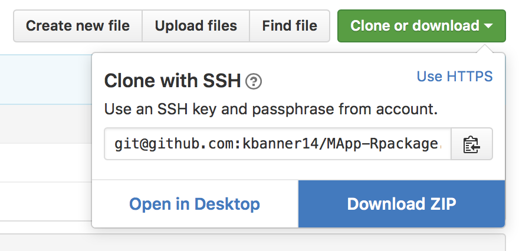

# `{MApp}`

The `{MApp}` package provides plotting functions to help researchers dissect and understand common inferences drawn from model averaging partial regression coefficients. There are five major plotting functions:  

- `MApp_bms` works with `bma` objects obtained from the `bms()` function in the `BMS` package (details about the `bms()` function can be found in the `BMS` tutorial [here](http://bms.zeugner.eu/tutorials/bms.pdf)). Returns the MAP plot and a table of posterior standard deviations.
- `MApp_IC` works with a data frame and conducts AIC, AICc, or BIC based model averaging for all-subsets regression. Returns the MAP plot and Model averaged results. 
- `MApp_IC_large` works with results from model averaging based on Information criteria. Requires the user to have the results first, but provides more flexibility than `MApp_IC`. Returns the MAP plot
- `MApp_MCMC` works with default output from the implementation of model averaging using the `OpenBUGS` or self programmed RJMCMC samplers. 
- `MApp_list` works with draws from self programmed RJMCMC samplers that store results from each model in a list. Returns the MAP plot and a table of posterior standard deviations.

# Load `{MApp}` 

`MApp` is not currently available on CRAN, so it must be installed from GitHub or loaded from your local disk. The package, `devtools` is necessary for both installs. To install `devtools`, run `install.packages("devtools")`.  

## GitHub Install
1. Install the latest version of `{MApp}` from GitHub. 

```{r install, echo = T, message = FALSE}
devtools::install_github("kbanner14/MApp-Rpackage", subdir = "MApp")
library(MApp)
```

2. Install package dependencies: `LearnBayes`, `beanplot`, `magritter`, `dplyr`, and `BMS`. Use `install.packages("packagename")` to install these packages.

## Load `{MApp}` From Local Disk

1. Install package dependencies: `LearnBayes`, `beanplot`, `dplyr`, and `BMS`. Use `install.packages("packagename")` to install these packages.
2. Download all files in the `MApp-Rpackage/` repository from the _Download Zip_ button  on the right hand side of the screen  [here](https://github.com/kbanner14/MApp-Rpackage). 
Git users may also clone the repository. 

3. Set your working directory to the location of the `MApp-Rpackage` repository on your computer. 
4. Run `devtools::load_all("MApp/.")` to load the package. Note that you must have the packages `devtools` and `roxygen2` installed (to install, run `install.packages(c("devtools", "roxygen2"))`).
5. Load the documentation by running `devtools::document(".")`

# Use `{MApp}`

Documentation is provided for all functions through `help()` and examples for all plotting functions are provided in the package vignette `MApp\vignettes\MApp-tutorial.Rmd`. The vignette is viewable within this repository by navigating to `MApp\vignettes` or as an html file at Rpubs [here (http://rpubs.com/kbanner14/203078)](http://rpubs.com/kbanner14/203078). 


