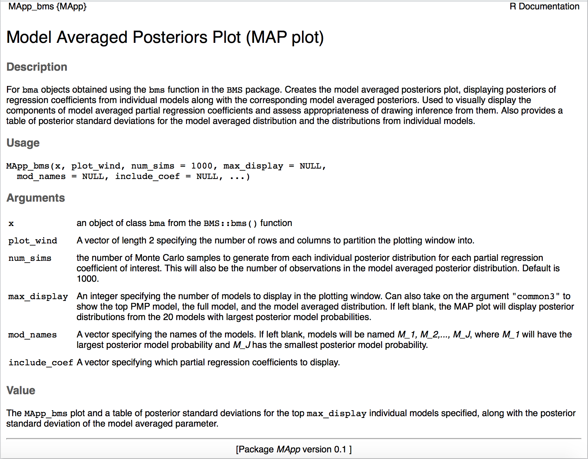

R statistical software [@R] is designed for statistical computation and graphics and is popular among statisticians and scientific researchers. The software is free and open source, meaning anyone can download the software for personal use, and anyone can contribute packages to be used with the software.  To make the model averaged posteriors plot accessible to as many users of model averaging as possible, we wrote the `MApp` package in the R programming language. `MApp` was developed to support work presented in [@banner-higgs2016], which discusses model averaging of regression coefficients for linear regression models. We provide a brief summary of model averaging in \ref{motivation-for-the-package}. 

# Motivation for the Package

Model averaging is advertised as a tool for "accounting for model uncertainty"" in analyses. To conduct model averaging, a set of models is considered ($\mathcal{M} = \{M_1, M_2, ..., M_J\}$, termed the model set). When considering model averaging in the linear regression framework, all first order combinations of the explanatory variables, or _all-subsets_, is a common model set to consider. For example, consider $p$ potential explanatory variables, the all-subsets model set has size $J = 2^p$ models, defined by models where each of the $p$ variables is either in or out of a particular model. 

Once the model set is defined, parameters of interest and posterior model probabilities, or weights based on information criteria such as AIC or BIC are calculated for all models in $\mathcal{M}$. The probabilities, or weights, are used as weights in a weighted average to combine information about quantities of interest across all models considered. @banner-higgs2016 and @HMRV99 provide more information about Bayesian model averaging, and @BurnhamAnderson2002 describe model averaging based on information criteria. 

# Model Averaging of Partial Regression Coefficients

Model averaging was developed in the context of prediction and its use has recently been extended to partial regression coefficients. Inference drawn from the latter application of typically results in explanations of "overall effects" for each of the coefficients of interest, presenting a unique question; what does "overall
effect" mean in the context of the research question? In the presence of multicollinearity, the interpretations of partial regression coefficients are not necessarily constant across models, making "overall effects" difficult to understand. Similarly, the posterior distributions for partial regression coefficients also take careful thought. Variables associated with partial regression coefficients can be in or out of a linear regression model. Excluding a variable from a linear regression model is equivalent to setting its associated partial regression coefficient to exactly zero. Therefore, the total probability of the posterior distribution of a model averaged partial regression coefficient is made up of two components, one coming from the models where the coefficient is set to zero (i.e., variable excluded from the model), the other coming from the models where the coefficient is estimated (i.e., variable included in the model). 

The `MApp` package provides the user with graphical tools for understanding what goes into model averaged partial
regression coefficients so their appropriateness may be assessed on a case-by-case basis. @banner-higgs2016 contains a detailed discussion of potential issues with, and considerations for assessing common inferences drawn from model averaging partial regression coefficients. 

There are many approaches for conducting model averaging including: self programmed reversible jump Markov chain Monte Carlo (MCMC) samplers; implementations in WinBUGS [@BUGS], described in @Link2006; and methods based on information criteria, described in @BurnhamAnderson2002. To accommodate as many users of model averaging as possible, we designed our plotting functions to work with posterior draws from existing software in R [@R] (such as `BMS`), self-coded reversible jump MCMC samplers, and AIC \& BIC based model averaging. 

# Installing MApp

`MApp` must be installed from GitHub or loaded from a local disk. The package, `devtools` [@devtools] is necessary for both installations. To install `devtools`, run `install.packages("devtools")` in the console.  

## GitHub Install 

GitHub [(https://github.com)](https://github.com) is an online service for hosting Git repositories. Git [(https://git-scm.com)](https://git-scm.com) is a version control software used primarily by developers for maintaining code. You do not need to be a Git user or have a registered GitHub account to use `MApp`, follow these two steps: 

1. Install Version 0.1 of `MApp` from GitHub. 

```{r install, echo = TRUE, message = FALSE, eval = FALSE}
# install the package
library(devtools)
install_github("kbanner14/MApp-Rpackage", subdir = "MApp")
# load the package
library(MApp)
```

2. To update `MApp` unload the package with `unload(inst("MApp"))` and repeat step 1. Note that both functions, `inst` and `unload`, are in the `devtools` package.

`MApp` uses functions from the following packages: `LearnBayes` [@LearnBayes], `beanplot` [@beanplot], `magrittr` [@magrittr], `dplyr` [@dplyr], and `BMS` [@FeldkircherZeugner2009]. These packages will be loaded automatically with a call to `install_github`. 

## Local Disk Install

Another option for installing `MApp` is to load it from a local directory. Follow these four steps for this type of installation. 

1. Download all files in the `MApp-Rpackage/` repository from the _Download Zip_ button  on the right hand side of the screen [here: https://github.com/kbanner14/MApp-Rpackage](https://github.com/kbanner14/MApp-Rpackage). Git users may also clone the repository.

2. Set your working directory to the location of the `MApp` repository on your computer.
3. Run the following lines of code to load the package and its documentation.

```{r echo = TRUE, eval=TRUE, results='hide', message=FALSE}
# load the pckage
devtools::load_all(".")

# load the R documentation files
devtools::document(".")
```

4. Install package dependencies: `LearnBayes` [@LearnBayes], `beanplot` [@beanplot], `magrittr` [@magrittr], `dplyr` [@dplyr], and `BMS` [@FeldkircherZeugner2009]. Use `install.packages("packagename")`

# `MApp` plotting functions 

The `MApp` package provides plotting functions to help researchers dissect and understand common inferences drawn from model averaging partial regression coefficients. There are five major plotting functions:  

- `MApp_bms` works with `bma` objects obtained from the `bms` function in the `BMS` package. Details about the `bms` function can be found in the `BMS` tutorial [here: http://bms.zeugner.eu/tutorials/bms.pdf](http://bms.zeugner.eu/tutorials/bms.pdf). This function returns the MAP plot and a table of posterior standard deviations.
- `MApp_IC` works with a data frame and conducts AIC, AICc, or BIC based model averaging for all-subsets regression. This function returns the MAP plot and Model averaged results. 
- `MApp_IC_large` works with results from model averaging based on Information criteria. Requires the user to have the results first, but provides more flexibility than `MApp_IC`. This function returns the MAP plot. 
- `MApp_MCMC` works with default output from the implementation of model averaging using the `OpenBUGS` or self programmed RJMCMC samplers. 
- `MApp_list` works with draws from self programmed RJMCMC samplers that store results from each model in a list. This function returns the MAP plot and a table of posterior standard deviations.

Documentation exists for all functions in `MApp`. Use the `?` or `help` to view the documentation. 

```{r test, echo = TRUE, eval = FALSE}
? MApp_bms 
```

 

# `MApp` package data 

- `bfat` A dataset containing percent body fat measurements, and 13 other body size measurements for 251 men. These data were originally collected by @Johnson96, and were used by @HMRV99 in their hallmark paper, _Bayesian Model avearging, A Tutoiral._ 
- `brainData` A dataset containing the log brain weight log(g), log body weight log(kg), log gestation length log(days), and litter size (# offspring) for 96 species of mammals. These data were modified from `case0902` in the R package `Sleuth2` [@SleuthPackage]. 

# The `MApp_bms` function

`MApp_bms` is designed to be used with the `bms` function in the `BMS` package [@FeldkircherZeugner2009]. The `bms` function executes a popular implementation of model averaging by placing Zellner's $g$-prior [@ZellnerSiow1980] on the regression coefficients, a user specified prior on the model set, and a user specified value for the hyperparameter, $g$. This implementation results in analytical posterior distributions for the regression coefficients in the form of $t$ distributions, allowing for quick computations. Detailed information about the $g$-prior implementation and its resulting posteriors is provided in @banner-higgs2016 (Supplement S1). 

The function `bms` takes on a data frame and prior information and returns model averaged results (PMPs, and means and standard deviations of the model averaged distributions for each partial regression coefficient). The function also saves useful information about the models considered, namely the central moments for the posterior distributions of the partial regression coefficients. We use this information to obtain the exact $t$ distributions for all partial regression coefficients in each model considered. Specifically, we use analytical results (@banner-higgs2016, Supplement S1). to find the appropriate degrees of freedom, and the central moments from `bms` to compute means and variances for each $t$ distribution. `MApp_bms` uses this information to obtain a specified number of Monte Carlo draws from posterior distributions of the partial regression coefficients for each individual model. Then, using the posterior model probabilities, `MApp_bms` samples proportionally from all individual posteriors to create a model averaged posterior distribution for each partial regression coefficient of interest. Therefore, `MApp_bms` obtains draws from all distributions going into the model averaged result and displays this information using density and rug plots, or beanplots, from the `beanplot` package [@beanplot] using a Gaussian smoothing kernel with default bandwidth `nrd0`. The bandwidth  is set according to Silverman's 'rule of thumb' (see the text Silverman B. W. (1986). _Density Estimation_, page 48, eqn (3.31)). 

## Example 1: A small model set

In this example we use `brainData`, which is comprised of average values of log gestation length log(days), litter size (number of offspring), log body size log(kg) and log brain weight log(g) for 96 species of mammals. The number of animals going into the average values for each species was not provided. 

```{r, brain, results='asis', echo = TRUE, eval = FALSE}
data(brainData)
head(brainData)
```

We suppose the researchers are interested in the relationship between log brain weight and log gestation length for all 96 mammal species. This relationship can be addressed directly with a simple linear regression model regressing log brain weight on log gestation length. Now we assume the researchers are asked to use model averaging to "account for model uncertainty," and we show how the MAP plot can be used to understand the results of model averaging the partial regression coefficient associated with log gestation length, and potentially defend the researchers' choice to use simple linear regression to address their question of interest. 

```{r brain2, echo = FALSE, results='asis'}
knitr::kable(head(brainData, 5))
```

We can use the `bms` function from the `BMS` package to obtain a `bma` object.

```{r bmsobj}
library(BMS)
brain <- bms(brainData, g = "UIP", 
                    mprior = "uniform", 
                    user.int = F)
class(brain)
```

We use `bms` to place Zellner's $g$-prior on the coefficients, and we specify a discrete uniform prior on the  $2^3=$ `r 2^3` models in the all-subsets model set. `MApp_bms` takes on two arguments that do not have default values: `x` and `plot_wind`. For this example, we specify `x = bma-object`, and `plot_wind = c(1,3)`, which tells the function to split the plotting window up into one row with three columns. We can add specific model names in place of the default $M_1, M_2,..., M_8$ with the `mod_names` argument. 

```{r bmsfig, fig.show = 'hold', fig.width = 7, fig.height = 5, fig.cap="MAP plot for the partial regression coefficients associated with each explanatory variable in the brainData dataset", message=FALSE, results='hide'}
map_brain <- MApp_bms(x = brain, plot_wind = c(1,3),
                      mod_names = c("BGL", "BG", "BL", "B", "G", "GL", "L", "Null"))
```

The model averaged posteriors plot displays both components of the model averaged posterior distribution.  The continuous component is represented by the black density and rug plot (beanplot), and the zero component is represented by text providing the probability of the point mass at zero. The dashed line extending up from the beanplot shows the mean of the model averaged posterior distribution, which incorporates the zero component; the larger the point mass at zero, the more the line will be pulled towards zero.  

### Reading the MAP plot

The MAP plot has three panels, one for each of the explanatory variables considered (log gestation length ($lgest$), log body size ($lbody$), and litter size ($litter$)). The posterior distributions of all partial regression coefficients for log body size, along with the posterior distribution of the model averaged partial regression coefficient associated with log body size (black beanplot and text) are shown in the first (leftmost) panel of Figure \ref{*2}. In this case, all models excluding log body size had such small posterior model probabilities that their sum is arbitrarily close to zero. That is, the point mass at zero is so small that it is essentially negligible and the posterior distribution for the model averaged partial regression coefficient from $\mathcal{M}$ (all models) is essentially equivalent to what would result from conditioning on the subset of models including log body size. So, for log body size, the continuous component of the posterior distribution of the model averaged partial regression coefficient gives essentially the same results as the model averaged posterior distribution considering both components.   

To contrast this, we highlight the panel summarizing the partial regression coefficient for litter (far right). One of the models excluding litter (Model BG) has a relatively large posterior model probability of 0.343, and the other two models excluding litter (Models G and B) have negligible posterior model probabilities. Therefore, the zero-component of the posterior distribution of the model averaged partial regression coefficient associated with litter is the sum over the posterior model probabilities for models G, B and GB, which is approximately 0.343. The mean line is pulled away from the center of the continuous component (black beanplot) toward zero, showing the effect of the point mass at zero.  Conditioning on models including litter, the model averaged posterior distribution is essentially a weighted average of the model with all three explanatory variables (with weight 0.569) and the model with log body and litter (with weight 0.088). Therefore, in this case we have one model contributing to the zero component, and two models contributing (very unevenly) to the continuous component of the model averaged distribution. This type of information is important for assessing the appropriateness of model averaged regression coefficient, and it is all easily discerned from the MAP plot. 

A Row across panels displays the posterior distributions of partial regression coefficients associated with explanatory variables considered in a particular model; the model name is shown in the margin and its posterior model probability is shown on the $y$-axis. In this example, the first row is associated with the model containing only litter (Model L, second row from the top). The posterior model probability for this model is so small that rounded to three decimal places it is 0.000. The posterior distribution for the coefficient associated with $litter$ in Model L is shown in the panel for $litter$, and the panels for $lgest$ and $lbody$ do not display posterior distributions because those explanatory variables were set explicitly to zero in Model L. All other rows are read in the same fashion. Comparing rows facilitates comparisons of posteriors for coefficients and model probabilities across models. The rows are ordered by increasing posterior model probability to facilitate easy comparisons between posteriors for partial regression coefficients from models contributing most to the model averaged results and their corresponding model averaged posterior distribution (displayed in the bottom row). 

The MAP plot also returns a table of posterior standard deviations for the model averaged result and the individual models displayed below. 

```{r echo = TRUE, eval = FALSE}
map_brain
```

```{r echo = FALSE, results = "asis"}
knitr::kable(map_brain, digits = 3)
```

A common motivation for model averaging is to account for model uncertainty, which is often equated to increased variances for quantities of interest. However, it is unclear whether this translation of model uncertainty into increased variances is realized for partial regression coefficients. We also include a table of posterior standard deviations with MAP to facilitate comparisons for particular examples. 

### Using the MAP Plot for Justifying Inference

We return to the original question of interest stated at the beginning of the example. The researchers were specifically interested in the relationship between mean brain weight and gestation length over all mammals (ignoring body size and litter size). The regression coefficient representing this relationship comes from the model with log gestation length as the only explanatory variable (Model G, third row in MAP plot above). We observe two things in the MAP plot above: (1) the model of interest has such a small posterior model probability that it is essentially ignored in the model averaging, and (2) the posterior distribution for the partial regression coefficient associated with log gestation length in the model of interest is clearly shifted to the right compared to the posterior distributions of the partial regression coefficients with large enough posterior model probabilities to contribute largely to the model averaging. That is, the posteriors contributing to the model averaged result for log gestation length and the posterior for the partial regression coefficient addressing the question of interest tell very different stories.  

We easily see from the MAP plot, that the total posterior probability for models that exclude log gestation length is about 0.088. The component of the model averaged posterior distribution conditional on log gestation length being in the model (continuous component) is essentially a weighted average of the posterior distributions from models GBL and GB: $p(\beta_{3.MA}|y, \mathcal{M}^*_L) = 0.569 p({\beta}_{3.gbl}|y) + 0.343 Pr(\beta_{3.bl}|y)$. Although we can see in the MAP plot above that the two posterior distributions contributing to the continuous component of the model averaged distribution are similar, the result is a mixture of two coefficients with different meanings: one conditional on log body size alone, and one conditional on both log body size and litter size. As we mentioned above, neither of these directly address the relationship of interest. We have seen researchers interpret model averaged coefficients as "overall effects" of their associated explanatory variables. However, this is technically incorrect and potentially very misleading. Not only is the interpretation difficult, but the model averaged distribution for the coefficient associated with log gestation length is essentially a weighted average of posterior distributions from only $two$ of the $eight$ models. While information like this is extremely important, it is not typically reported or discussed and the MAP plot tells a clear visual story to convey this information.

This example, though simple, illustrates the complexities of model averaging regression coefficients, and demonstrates model averaging leads to tough decisions of its own, just like defending the choice of one model. Such decisions should be accompanied by a thorough description of the main components going into the model averaging. Whether the researcher chooses to condition inference on one model or use an approach like model averaging, the decisions and justifications along the way should be driven by the research question and the intended use of the results. When a specific question is well defined, an appropriate way to address that question can be to build a regression model driven by the question itself. Building such a model requires careful thought effort to justify, making it tempting to elicit some sort of automatic approach to find the "best" model or combine results over multiple models. Something we often lose sight of when building models is that the "best" model, whether it be based on AIC, $p$-values or some other model selection criteria may not be consistent with addressing the original question. So, while model averaging may hold the allure of a decision-free model building technique (just use all of them), we must consider whether the result of the procedure leaves us with the ability to address the relationships we set out to investigate in the first place. We urge researchers to think hard about what research questions they are investigating and whether "accounting for model uncertainty" is worth the potential loss in interpretation and ability to address the question(s) of interest. We present the MAP plot as a way to help with this goal. 


##Example 2: `MApp_bms` with Large Model Sets

We will use the `bfat` data which contain 13 body fat measurements from 251 men to demonstrate the flexibility of our plotting function for problems with a larger set of potential predictors. 

First, we will take a look at these data and create a `bma` object, `bfat_bms`, using the `bms` function (again, we chose a uniform prior on the model space and Zellner's $g$-prior @Zellner1984 with $g = n$).


```{r, results='asis', eval = FALSE}
data(bfat)
head(bfat)
````
```{r, echo = FALSE, results='asis'}
knitr::kable(head(bfat, 5))
```
```{r message=FALSE, results='hide'}
# create bma object using bfat data
bfat_bms <- bms(bfat, mprior = "uniform", g = "UIP", user.int = F)
```

If we consider all potential first-order combinations of the predictors, there are $2^{13} =$ `r 2^(13)` potential models in the model set. By default a `bma` object generated by `bms` will store weights and posterior summary measures for the top 500 models considered. Using the closed form posterior results for model averaging with a $g$-prior on the regression coefficients, `MApp_bms` will obtain a specified number of draws from the analytical posterior distributions for all models stored in the `bma` object and will create a model averaged distribution by sampling from these individual posteriors with normalized probabilities to retain proportionality from model averaging including all models. The proportion of posterior model mass accounted for by the top 500 models should be checked to ensure the approximate model averaged distribution created by `MApp_bms` is reasonable. In this case, the top 500 models accounted for approximately `r 100*round(sum(pmp.bma(bfat_bms)[,1]), 2)`% of the posterior mass and we can be confident that the approximate model averaged distributions will be very similar to the model averaged distributions when all models are considered. 

```{r}
# see how much of the posterior model mass is accounted for by the top 500
# models
sum(pmp.bma(bfat_bms)[,1])
```

Because plotting 500 models simultaneously would make MAP plot impossible to read, we can tell `MApp_bms` to display a subset of those models using the `max_display` argument.  We can also specify which coefficient to include in the model averaged posteriors plot with the `include_coef` argument. If `max_display` and `include_coef` are left unspecified, the function will display the 20 models with the largest PMP. 

```{r bfatplot, fig.width=7, fig.height= 5, message= FALSE, results='hide'}
map_bfat <- MApp_bms(bfat_bms, plot_wind = c(1,3), 
                        include_coef = c(13, 2, 4), 
                        max_display = 10, 
                        num_sims = 1000)
```

```{r bfat-tab, echo = TRUE, eval = FALSE}
map_bfat
```

```{r bfat-tab2, echo = FALSE, results = 'asis'}
knitr::kable(map_bfat, digits = 3)
```

It is also common to obtain approximate posterior model probabilities (model weights) from certain information criterion (most commonly: BIC, AICc or AIC). A version of the MAP plot can be created for comparing confidence intervals for partial regression coefficients across the models in the model set. 

## Using `MApp_IC`

`MApp_IC` generates results from approximations to posterior model probabilities (PMPs) based on two user specifications: (1) the type of information criterion, and (2) the method for model averaging (conditional on models allowing the coefficient to be estimated vs. using all models in the model set). The default for `MApp_IC` conducts BIC based model averaging (`type = "BIC"`) and considers all models in the model set (`w_plus = FALSE`). Here, we make the MAP plot for the `brainData` with the default specifications.

```{r, echo = FALSE, results = 'hide',fig.width= 8, fig.height=5, eval = FALSE, message=FALSE}
MApp_IC(brainData, plot_wind = c(1,3), 
        type = "BIC", w_plus = FALSE)
```

```{r, echo = FALSE, results = 'asis',fig.width= 8, fig.height=5}
brain_bic <- MApp_IC(brainData, plot_wind = c(1,3), 
                     type = "BIC", w_plus = FALSE)
knitr::kable(brain_bic[,c(1:5)], digits = 3)
knitr::kable(brain_bic[,c(1,c(6:9))], digits = 3)
knitr::kable(brain_bic[,c(1,c(10:13))], digits = 3)
```

The function returns messages providing the type of model averaging used and other useful output, including AICc based MA results. 

Sometimes researchers choose to condition their results on the subset of models including the variables of interest (i.e., models where associated coefficients are not set to 0), described in @BurnhamAnderson2002. Setting the argument `w_plus = TRUE` tells `MAPP_IC` to conduct this type of model averaging.

```{r echo = TRUE, results= "asis",fig.width= 8, fig.height=5, eval = FALSE}
MApp_IC(brainData, plot_wind = c(1,3), 
        type = "BIC", w_plus = TRUE)
```

```{r echo = FALSE, results= "asis",fig.width= 8, fig.height=5}
brain_bic2 <- MApp_IC(brainData, plot_wind = c(1,3), 
                     type = "BIC", w_plus = TRUE)
```

The message now indicates the alternative type of model averaging was conducted. 

This function works best with modest numbers of explanatory variables because it uses `bms` to define an all-subsets model set. When 9 explanatory variables are considered, the all-subsets model set contains 512 models, and by default `bms` will only store results from 500 models. Therefore, if this function is used with data containing 9 or more explanatory variables, it is important for the user to make sure the sum of the PMPs for the top 500 models (estimated using `bms`) is large enough so conditioning on those 500 models is appropriate for IC-based model averaging. A more flexible, but less automatic function included in this package is `MApp_IC_gen` (see Section \ref{sec4:mappicgen}).

- Add `bfat` example to show the flexibility of the function and `max_display` option?


Results from IC based model averaging can be used as input arguments to 
`MApp_IC_gen` to create the MAP plot. This function requires the user to input four arguments: (1) a matrix of maximum likelihood estimates of the coefficients of interest for each model considered, (2) a matrix of standard errors for those estimates, (3) a vector (length = $J$) of model weights, and (4) a matrix of zeroes and ones corresponding to the variables included in each model (all matrices will be $J$ rows and $p$ columns). The user can choose not to include all $J$ models by using a subset of the models in the four inputs.

We use the `braindata` to demonstrate this function. 

```{r ICbrain, echo = TRUE, results='asis'}
post_means <- t(brain$topmod$betas())
post_means[post_means != 0] <- 1
inmat <- post_means

IC_approx <- approx_pmp(inmat, Xmat = brainData[,-1], Yvec = brainData[,1])
knitr::kable(IC_approx[,c(1:5)], digits = 3)
knitr::kable(IC_approx[,c(1,6:9)], digits = 3)
knitr::kable(IC_approx[,c(1,10:13)], digits = 3)
```

Use `MApp_IC_gen`

```{r echo = TRUE, fig.width= 8, fig.height=5}
# BIC weights
x_coef <- IC_approx[c(2:10), c(7:9)]
x_se <- IC_approx[c(2:10), c(11:13)]
pmp <- as.numeric(as.character(IC_approx[c(3:10),2]))
MApp_IC_gen(x_coef = x_coef, x_se = x_se, pmp = pmp, inmat = inmat)
```


# MApp for Self-Programmed Samplers

Another way to conduct Bayesian model averaging is to use  `BUGS`, `OpenBUGS`, or a self-programmed reversible jump Gibbs sampler. In this case, the user will have posterior draws for partial regression coefficients estimated by each of the models $\mathcal{M}$. Chains of posterior draws are usually stored in a list (length usually equal to the cardinality of the model set, unless certain models are never visited), or in a matrix with posterior draws for quantities of interest (including model) as variable in the matrix. If draws come in the form of a matrix, the MAP plot can be created directly with `MApp_MCMC`. 

## `MApp_MCMC`

Here we show how the MAP plot can be made using results similar to the posterior draws that would be obtained from implementing model averaging with WinBUGS [@BUGS] or `R2OpenBugs` [@R2bugs]. Typically draws are extracted using the `coda` [@CODA] and they will have a column for model and columns for the estimates of partial regression coefficients. Here, we use fake data considering 3 variables and 7 models.  

```{r mcmc-matrix, echo = FALSE, warning=FALSE, message=FALSE}
set.seed(12)
mcmc_mat <- data.frame(LearnBayes::rmnorm(700, mean = c(-1,3,6), varcov = diag(3)))
mcmc_mat$model <- rep(paste0("M",1:7), each = 100)
mcmc_mat <- mcmc_mat[,c(4,1,2,3)]
inmat <- matrix(c(1,1,1,
  			  1,1,0, 
				  1,0,1,
				  0,1,1,
				  1,0,0,
				  0,1,0,
				  0,0,1), 
				 byrow = T, 
				 nrow = 7, 
				 ncol = 3)

for(i in 1:7){
  idx <- which(mcmc_mat[,1] == paste0("M",i))
  mcmc_mat[idx, c(2:4)] <- t(apply(mcmc_mat[idx,c(2:4)], 1 , function(x){x*inmat[i,]}))
  }

# shuffle order
mcmc_mat <- mcmc_mat[sample(1:700, size = 700, rep = F),]
```

The data are of the form: 
```{r MCMC, results='asis', eval = FALSE, echo = TRUE}
head(mcmc_mat)
```
```{r MCMC2, results='asis', echo = FALSE}
knitr::kable(head(mcmc_mat))
```

Create the MAP plot using `MApp_MCMC`

```{r MCMCmat, fig.width=7, fig.height=5, echo=TRUE}
MApp_MCMC(mcmc_mat, plot_wind = c(1,3))
```

Another option in `max_display` (common to all Bayesian model averaging MAP plot functions) is `"common3"`, which displays the top PMP model, the model including all explanatory variables, and the model averaged result. 

```{r MCMCcommon, fig.width=7, fig.height=5, echo=TRUE}
MApp_MCMC(mcmc_mat, plot_wind = c(1,3), max_display = "common3")
```

In this example, the posterior model probabilities are all equal, resulting in equivalent posterior exclusion probabilities (point masses at zero) for the partial regression coefficients associated with each explanatory variable. The overall mean for the model averaged posterior distribution gets pulled toward zero in all three panels, but we see the most "shrinkage" in the panel for $X_3$. This is a result of the individual model posteriors for the coefficients associated with $X_3$ being distributed similarly; specifically being centered away from zero with relatively small variance. 

The table of posterior standard deviations shows how a relatively large posterior exclusion probability can affect the posterior variance of the model averaged distribution. We observe that the posterior variance of the continuous component of the model averaged distribution is similar to the posterior variances from the corresponding individual models. When considering the zero component, the model averaged posterior distribution has larger variance for the partial regression coefficients associated with $X_2$ and $X_3$, and smaller variance for the partial regression coefficients associated with $X_1$. This is a result of the location of the continuous component. 

## `MApp_list`

Another common format for posterior draws is a list, in which case, `MApp_list` can be used. For this example, the posterior draws from the model with the highest PMP are in the first element of the list, and posterior draws from the model with the smallest PMP are in the last element of the list. 

```{r, echo = FALSE, message = FALSE}
data_sim <- function(n = 60, p = 5, betas = c(0,0,0,1,1.2), 
                    sig_y = 2.5, sig_x = rep(1, 5), cor_x = 0,
                    cor_vars = c(3,5), tol = 0.05, truth4 = F, 
                    b42 = 0.5, b43 = 0.25, ...){
  # for now we are just going to assume that two of the variables are 
  # correlated X3 and X5, can change this with cor_vars
  try(if(length(betas) != p)  
    stop("dimensions of betas and number of parameters (p) must agree"))
  
    # draw iid normal x's, then use cor matrix (R) and Cholesky 
    # factorization to get desired correlation structure in x's
    
    var_x <- sig_x^2
    cov <- diag(var_x)
    R <- diag(p)
    R[cor_vars[1], cor_vars[2]] <- cor_x
    R[cor_vars[2], cor_vars[1]] <- cor_x
    U <- t(chol(R))
    
    
    # simulate the x matrix 
    Xmat <- LearnBayes::rmnorm(n, mean = betas, varcov = cov)
    Xmat <- t(U %*% t(Xmat))
    c <- abs(cor_x - cor(Xmat[,cor_vars[1]], Xmat[, cor_vars[2]]))
    
    while(c >= tol) {
      Xmat <- LearnBayes::rmnorm(n, mean = betas, varcov = cov)
      Xmat <- t(U %*% t(Xmat))
      c <- abs(cor_x - cor(Xmat[,cor_vars[1]], Xmat[, cor_vars[2]]))
    }
    
    dimnames(Xmat)[[2]] <- paste0("X", 1:p)
    
    # generate y 
    epsilon <- rnorm(n, 0, sig_y)
    # check for truth 4 scenario
    if(truth4 == F){
      Y <- Xmat%*%matrix(betas) + epsilon
    } else {
        X4sq <- Xmat[,4]^2
        X4cu <- Xmat[,4]^3
        Xmat <- cbind(Xmat, X4sq, X4cu)
        betas <- c(betas, b42, b43)
        Y <- Xmat%*%matrix(betas) + epsilon
        Xmat <- Xmat[,1:5]
      }
    # make the dat frame
    dat <- scale(data.frame(Y,Xmat), center = T, scale = T)
    dat <- data.frame(dat)
    return(dat)
    
}

fake_dat <- data_sim(cor_x = 0.8)
fd <- bms(fake_dat, g = "UIP", mprior = "uniform", user.int = F)
inmat <- t(fd$topmod$betas())
inmat[inmat !=0 ] <- 1
mcmc_list <- bms_post_sim(inmat, Xmat = fake_dat[,-1], Yvec = fake_dat[,1], num_sims = 1000)
names(mcmc_list) <- paste("M", 1:32, sep = "_")
samps <- round(pmp.bma(fd)[,2]*1000)
for(i in 1:32){
  mcmc_list[[i]] <- mcmc_list[[i]][1:samps[i],]
}
mcmc_list <- mcmc_list[1:23]
```

```{r, fig.width = 10, fig.height= 6, out.width= ".9\\linewidth"}
MApp_list(mcmc_list, plot_wind = c(1,5), max_display = 10)
```

Unlike the MApp plot, the number of draws from each individual model is proportional to the posterior model probability, and some beanplots may be drawn with very few observations.

# Other Functions in `MApp` 

This chapter highlighted the plotting functions in `MApp`, however, many of the other functions in this package are useful for studying properties of model averaged posteriors for partial regression coefficients under the $g$-prior implementation of Bayesian model averaging. Use `help(package = "MApp")` to see a list of all functions in the package and their descriptions (Figure \ref{fig4:help}). 

 

# References 

